---
lab:
    title: 'Lab 1: Data Modeling'
    module: 'Module 1: Create a model-driven app in Power Apps'
---

# Practice Lab 1  – Data Modeling

## Scenario

A regional building department issues and tracks permits for new buildings and updates for remodeling of existing buildings. Throughout this course you will build applications and perform automation to enable the regional building department to manage the permitting process. This will be an end-to-end solution which will help you understand the overall process flow.

In this lab, you will set up a second environment to mimic a production environment for learning purposes and create solutions to track your changes. You will also create a data model to support the following requirements:

- R1 – Track the status of permits issued for new buildings and existing building modifications
- R2 – Permits are associated with a Build Site, which represents the building or land being modified
- R3 – Permit type indicates the type of permit and inspections, other data that might be required on a permit
- R4 – Inspections completed on the permit work are to be tracked for the entire process i.e., from request of inspection to the pass or fail of the inspection
- R5 – Permits, for our lab purposes, are requested by a person and we need to track who requested each permit

## High-level lab steps

To prepare your learning environments you will create a solution, a publisher, and add both new and existing components that are necessary to meet the application requirements. Refer to the data model document for the metadata description (tables, column types and relationships). Your solution will contain several tables upon completion of all the customizations.

## Things to consider before you begin

- What are considered as best practices for managing changes in between environments (“Dev” to “Test” to “Prod”)? Are there additional considerations for team solution development?
- What tables a user might need in the scenario that we are building?
- What relationship behaviors would we consider enabling users to complete their tasks?
- Remember to work in your *Development* environment with the customizations. Once the customizations are completed, published and tested in *Development*, and if everything works fine, the same will be deployed to *Live*.

## Exercise 1: Create solution

**Objective:** In this exercise, you will create a publisher and solution for your cusotmizations.

### Task 1.1 – Maker portal

1. Navigate to the Power Apps maker portal <https://make.powerapps.com> and sign in with your Microsoft 365 credentials if prompted again.

1. If you are prompted for a *Phone number* enter **0123456789** and click on **Submit**.

1. Switch environments by using the Environment Selector in the upper right corner of the screen. The Contoso (Default) environment will be selected by default.

1. Select your **Development** environment from the list.

    

1. Select **Apps** from the left navigation pane. You should see a single app, Solution Health Hub, listed.

1. Select **Tables** from the left navigation pane. You should see the standard tables from the Common Data Model.

### Task 1.2 – Create solution and publisher

1. Select **Solutions** from the left navigation pane. You should see several solutions including the Default solution and the Common Data Services solution.

    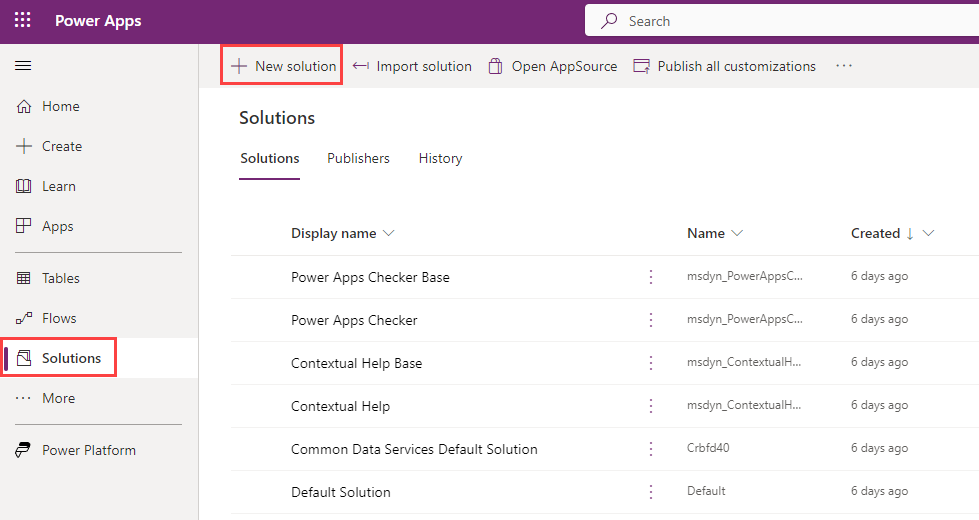

1. Click **+ New solution**.

1. In the **Display name** text box, enter **Permit Management**. The Name text box should be automatically populated.

   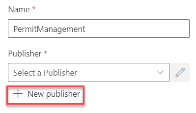

1. Click **+ New publisher** below the **Publisher** dropdown.

1. In the **Display name** text box, enter **Contoso**.

1. In the **Name** text box, enter **contoso**.

1. In the **Prefix** text box, enter **contoso**.

   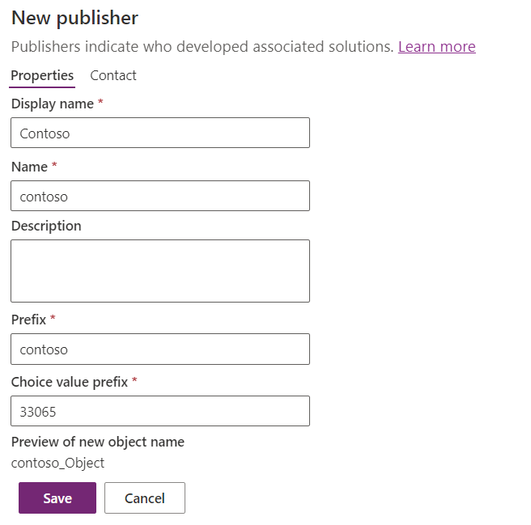

1. Click **Save**.

1. In the **Publisher** drop-down, select **Contoso**.

1. Click **Create**.

## Exercise 2 - Add components to the solution

In this exercise, you will add existing tables to the solution.

### Task 2.1 – Add existing tables

1. Navigate to the Power Apps maker portal <https://make.powerapps.com>.

1. Make sure you are in the Development environment.

1. Select **Solutions**.

1. Open the **Permit Management** solution you created in the previous exercise.

1. Click on **Add existing** and select **Table**.

    

1. Search for `contact` and select the **Contact** table.

1. Click **Next**.

1. Click **Select objects**.

   

1. Select the **Views** tab.

1. Select the **Active Contacts** view.

1. Click on **Add**.

1. Click **Select objects**.

1. Select the **Forms** tab.

1. Select the **Contact** form.

1. Click on **Add**.

1. You should have **1 view** and **1 form** selected.

   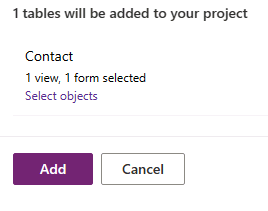

1. Select **Add**. This will add the Contact table to the Practice Management solution.

1. Click on **Add existing** and select **Table**.

1. Search for `user` and select the **User** table.

1. Click **Next**.

1. **DO NOT** select any objects and Select **Add**. Your solution should now have two tables.

## Exercise 3: Create tables and columns

In this exercise, you will create tables, add columns to these tables, and edit the **Status Reason** options for the **Permit** and **Inspection** tables.

### Task 3.1: Create Permit table and columns

1. Navigate to the Power Apps maker portal <https://make.powerapps.com>.

1. Make sure you are in the Development environment.

1. Select **Solutions**.

1. Open the **Permit Management** solution.

1. Click **+ New** and then select **Table**.

   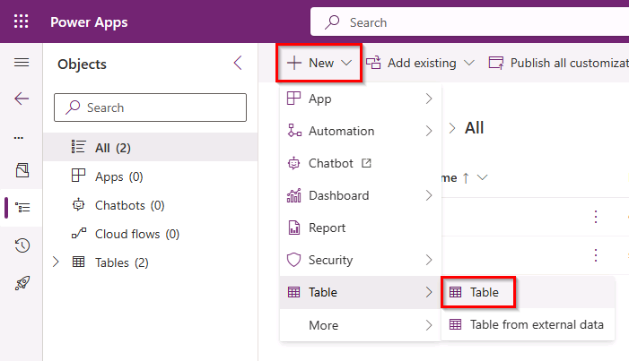

1. Enter **Permit** for **Display Name**. The plural name will be automatically populated.

1. Click **Save**.

1. Under **Schema**, select **Columns**.

1. Click **+ New column**.

    

1. Enter **Start Date** for **Display name**.

1. Select **Date and time** in the **Data type** drop-down and then select **Date only**.

1. In the **Required** drop-down, select **Business required**.

1. Click **Save**.

1. Click **+ New column**.

1. Enter **Expiration Date** for **Display name**.

1. Select **Date and time** in the **Data type** drop-down and then select **Date only**.

1. Click **Save**.

1. Click **+ New column**.

1. Enter **New Size** for **Display name**.

1. Select **Number** in the **Data type** drop-down and then select **Whole number**.

1. Click **Save**.

### Task 3.2: Create Permit Type table and columns

1. Create Permit Type table

   - In the **Objects** pane, select **All**.

     
  
   - Select **+ New > Table** and select **Table**.
   - Enter `Permit Type` for **Display name**.
   - Select **Save**.

1. Create Require Inspections column

   - Open the **Permit Type** table.
   - Under **Schema**, select **Columns** and select **+ New column**.
   - Enter `Require Inspections` for **Display name**.
   - Select **Choice > Yes/no** for **Data type**.
   - Select **Save**.

1. Create Require Size column

   - Select **+ New column**.
   - Enter `Require Size` for **Display name**.
   - Select **Choice > Yes/no** for **Data type**.
   - Select **Save**.

### Task 3.3: Create Build Site table and columns

1. Create Build Site table

   - In the **Objects** pane, select **All**.
   - Select **+ New > Table** and select **Table**.
   - Enter `Build Site` for **Display name**.
   - Select the **Primary column** tab.
   - Change the **Display Name** to `Street Address`
   - Expand **Advanced options**.
   - Change the **Schema name** to `street1`
   - Select **Save**.

     

1. Add City column

   - Open the **Build Site** table.
   - Under **Schema**, select **Columns** and select **+ New column**.
   - Enter `City` for **Display name**.
   - Verify **Single line of text** is selected for **Data type**.
   - For **Required**, select **Business required**.
   - Expand the **Advanced options**.
   - Set **Schema name** to `city`
   - Select **Save**.

     

1. Add Zip/Postal Code column

   - Select **+ New column**.
   - Enter `ZIP/Postal Code` for **Display Name**.
   - Verify **Single line of text** is selected for **Data type**.
   - For **Required**, select **Business required**.
   - Expand the **Advanced options**.
   - Set **Schema name** to `postalcode`
   - Select **Save**.

1. Add State/Province column

   - Select **+ New column**.
   - Enter `State/Province` for **Display Name**.
   - Verify **Single line of text** is selected for **Data type**.
   - For **Required**, select **Business required**.
   - Expand the **Advanced options**.
   - Set **Schema name** to `stateprovince`
   - Select **Save**.

1. Add Country/Region column

   - Select **+ New column**.
   - Enter `Country/Region` for **Display Name**.
   - Verify **Single line of text** is selected for **Data type**.
   - For **Required**, leave it set as **Optional**.
   - Expand the **Advanced options**.
   - Set **Schema name** to `country`
   - Select **Save**.

### Task 3.4: Create Inspection Table and Columns

1. Create Inspection table

   - In the **Objects** pane, select **All**.
   - Select **+ New > Table** and select **Table**.
   - Enter `Inspection` for **Display name**.
   - Select **Save**.

1. Add Inspection Type Column

   - Open the **Inspection** table.
   - Under **Schema**, select **Columns** and select **+ New column**.
   - Enter `Inspection Type` for **Display name**.
   - Select **Choice > Choice** for **Data type**.
   - Under **Sync this choice with**, select **+ New choice**.
   - Enter `Inspection Type` for **Display name**.
   - Enter `Initial Inspection` for **Label** and select **+ New choice**.

     

   - Enter **Final Inspection** for **Label** and select **Save**.

     

   - For **Sync this choice with**, select **Inspection Type** from the drop-down.

   - Select **Save**.

1. Add Scheduled Date Column

   - Select **+ New column**.
   - Enter `Scheduled Date` for **Display name**.
   - Select **Date and time > Date only** for **Data type**.
   - For **Required**, select **Business required**.
   - Select **Save**.

1. Add Comments column

   - Select **+ New column**.
   - Enter **Comments** for **Display name**.
   - For **Data type**, select **Text > Multiple Lines of Text > Plain Text**.
   - Select **Save**.

1. Add Sequence column

   - Select **+ New column**.
   - Enter `Sequence` for **Display name**.
   - Verify **Single line of text** is selected for **Data type**.
   - Select **Save**.

1. From the left navigation, select the **<- Back to solutions** button.

1. Select **Publish All Customizations.**

   

### Task 3.5: Edit Status Reason Options

1. Open the Permit Management solution

   - Navigate to `https://make.powerapps.com`
   - Select **Solutions** from the left menu and open the **Permit Management** solution.

1. Switch to Classic

   - Select on the **…** icon and select **Switch to Classic**.

     

1. Edit Inspection table Status Reason options

   - Expand **Entities**.
   - Expand the **Inspection** table and select **Fields**.

     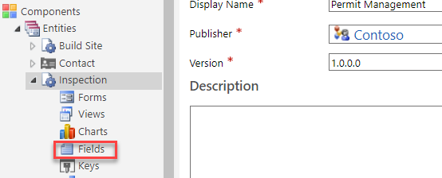

   - Locate and double click to open the **statuscode** Column.

     

1. Change the Active option label

   - Make sure you have **Active** selected for **Status**.
   - Select the **Active** option and select **Edit**.

     

   - Change the **Label** to **New Request** and select **OK**.

     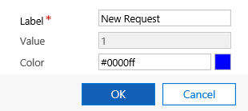

1. Add the Pending option

   - Select **Add**.

     

   - Enter **Pending** for **Label** and select **OK**.

1. Add the Passed option

   - Select **Add**.
   - Enter **Passed** for **Label** and select **OK.**

1. Add the Failed option

   - Select **Add**.
   - Enter **Failed** for **Label** and select **OK.**

1. Add the Canceled option

   - Select **Add**.
   - Enter **Canceled** for **Label** and select **OK.**

1. Your option-set should now have 5 options for the **Active** state.

   

1. Select Pending as the Default Value and select **Save and Close** from the top menu.

   

1. Edit Permit table Status Reason options

   - Expand the **Permit** table and select **Fields**.

     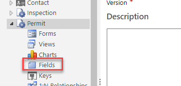

   - Locate and double click to open the **statuscode** Column.

1. Add the Locked option

   - Make sure you have the **Active** selected for **Status**.
   - Select **Add**.
   - Enter **Locked** for Label and select **OK**.

1. Add the Completed option

   - Select **Add**.
   - Enter **Completed** for Label and select **OK**.

1. Add the Canceled option

   - Select **Add**.
   - Enter **Canceled** for Label and select **OK**.

1. Add the Expired option

   - Select **Add**.
   - Enter **Expired** for Label and select **OK**.

1. Your option-set should now have 5 options for the **Active** state

   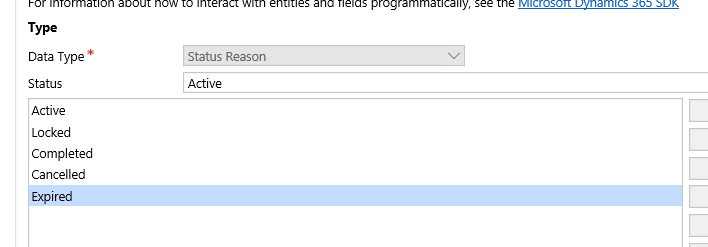

1. Select the **Active** for the **Default Value** and select **Save and Close** from the top menu

1. Select **Information** from the left side menu and click **Save and Close** to close classic solution explorer

   

1. Select the **<- Back to solutions**.

1. Select **Publish all customizations**.

## Exercise 4: Create Relationships

**Objective:** In this exercise, you will create relationships.

### Task 4.1: Create Relationships

1. Open the Permit Management solution

   - Sign in to [Power Apps maker portal](https://make.powerapps.com/)
   - Select **Solutions** and open the **Permit Management** solution.

1. Create Permit to Contact relationship

   - Open the **Permit** table.
   - Under **Schema**, select **Relationships**.
   - Select **+ New relationship** and select **Many-to-one**.
   - Select `Contact` for the **Related (One) > Table** and select **Done**.

    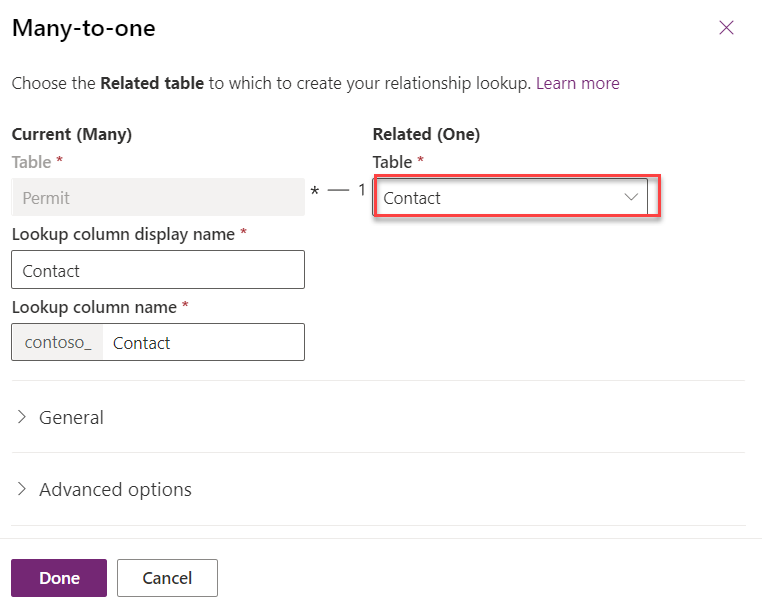

1. Create Permit to Inspection relationship

   - Select **+ New relationship** and select **One-to-many**.
   - Select `Inspection` for **Table** in the **Related (Many)** and expand **Advanced options**.

    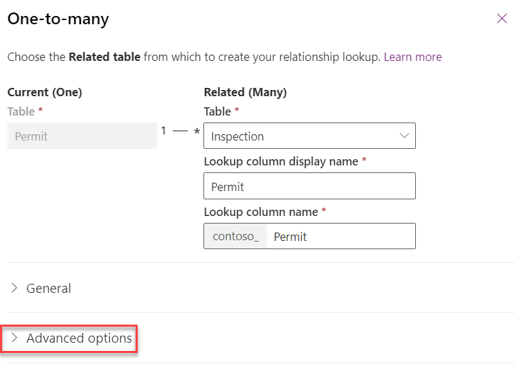

   - Change the **Type of behavior** to **Parental** and select **Done**.

    

1. Create Permit to Build Site relationship

   - Select **+ New relationship** and select **Many-to-one**.
   - Select `Build Site` for **Related (One) > Table** and expand **Advanced options**.
   - Change the **Delete** field to **Restrict** and select **Done**.

    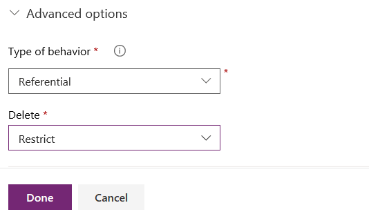

1. Create Permit to Permit Type relationship

   - Select **+ New relationship** and select **Many-to-one**.
   - Select `Permit Type` for **Related (One) > Table** and select **Done**.

1. Select the **Back to solutions** button from the left navigation menu and select **Publish all customizations**.
