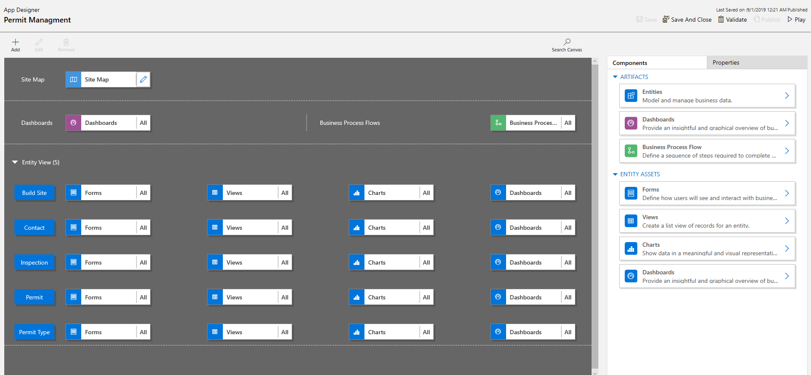
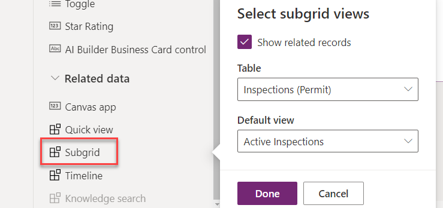
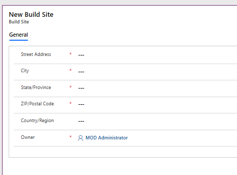
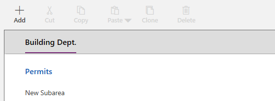

---
lab:
    title: 'Lab 2: Model driven app'
    module: 'Module 1: Create a model-driven app in Power Apps'
---

# Practice Lab 2 – Model driven app

## Scenario

A regional building department issues and tracks permits for new buildings and updates for remodeling of existing buildings. Throughout this course you will build applications and automation to enable the regional building department to manage the permitting process. This will be an end-to-end solution which will help you understand the overall process flow.

In this lab we will continue to build on top of the components created in the previous lab. We will now build a Power Apps model-driven app to allow the office staff manage records for the inspectors and the inspectors to manage their own records as needed.

## High-level lab steps

As part of creating the model-driven app, you will complete the following:

- Create a new model-driven app named Permit Management
- Edit the app navigation to reference the required tables
- Customize the forms and views of the required tables for the app

**Views**: As the name suggests, this helps viewing the existing data in the form of table. This is the configuration of the columns that will be displayed on the screen.

**Forms**: This is where the user creates/updates new records in the tables.

Both will be integrated to the model-driven app for a better user-experience.

The following is what the model-driven app designer looks like when all the customizations are completed:

## Things to consider before you begin

- What changes should we make to improve the user experience?
- What should we include in a model-driven app based on the data model we’ve built?
- What customizations can be made on the sitemap of a model-driven app?
- Remember to continue working in your DEVELOPMENT environment. We’ll move everything to production once everything is built and tested.

## Exercise 1: Customize Views and Forms

**Objective:** In this exercise, you will customize views and forms of the tables that will be used in the model-driven app.

### Task 1.1: Edit Permit Form and View

1. In your development environment, open the Permit Management solution.

   - Sign in to [Power Apps maker portal](https://make.powerapps.com/)
   - Select your **Dev environment.**
   - Select **Solutions**.
   - Open the **Permit Management** solution.

1. Steps to edit the Permit table form.

   - Open the **Permit** table.
   - Under **Data experiences**, select **Forms**.
   - Edit the **Main** form. By default, the form has two columns, Name (Primary column) and Owner.

     

   - Drag the **Permit Type** column to the form and place it below the **Name** column.

     

   - Add **Build Site** lookup, **Contact** lookup, **Start Date** and **New Size** to the form.
  
     

   - Select the header of the form.
  
   - Add the **Status Reason** column to the form header.

      

1. Add new tab for **Inspections** to the form.

   - With focus set on the main body of the form (not in the header) select **Add Component**.

     

   - Select **1-column tab**.

      

   - Select the new tab you added.

   - Go to the **Properties** pane, change the **Label** to **Inspections** and the **Name** to **inspectionsTab**.

     

1. Steps to add Sub-Grid to the Permit form.

   - Select the **Inspections** tab. Make sure that you have selected the whole tab and not just a section.

   - Select **Add Component**.

   - Scroll down and select **Subgrid,** this will open a pop-up to select table.

   - Check the **Show related records** checkbox, select **Inspections (Permit)** for **Table**, select **Active Inspections** for **Default View** and select **Done**.

     

1. Edit Sub-Grid properties.

    - Go to the sub-grid properties pane and change the Label to **Inspections**.

      

1. Steps to hide the section label

   - Select the section.

     

   - Go to the **Properties** pane and check the **Hide Label** checkbox.

     

1. Select **Save** and wait for the save to complete.

1. Select **Publish** and wait for the publishing to complete.

1. Select on the **<- Back** button. You should now be back to the Permit table Forms tab.

1. Steps to edit the Active Permits view.

   - Select the **Views** tab and open the **Active Permits** view.
   - Drag the **Build Site** column and drop it between the **Name** and **Created On** columns.
   - Select on the **Permit Type** column. The Permit Type column will be added to the view.
   - Select the **Contact** column. The **Contact** column will be added to the view.
   - Go to the view designer and select on the chevron icon of the **Created On** column.
   - Select **Remove**. **Created On** column will now be removed from the view.
   - Select **Save** and wait until the changes are saved.
   - Select **Publish** and wait for the publishing to complete.

1. Select on the **<-Back** button.

### Task 1.2: Edit Build Site Form and View

1. Open the Permit Management solution.

   - Sign in to [Power Apps maker portal](https://make.powerapps.com/)
   - While in your dev environment, select **Solutions**, and open the **Permit Management** solution.

1. Edit the Build Site table form.

   - Select to open the **Build Site** table.
   - Select the **Forms** tab and open the **Main** form.
   - Add **City**, **State/Province**, **Zip/Postal Code**, and **Country Region** columns to the form between **Street Address** and **Owner**.

     

1. Select **Save** and wait until the changes are saved.

1. Select **Publish** and wait for the publishing to complete.

1. Select on the **<-Back** button.

1. Edit the Active Build Sites view.

   - Select the **Views** tab and open the **Active Build Sites** view.
   - Add **City** and **Zip/Postal Code** to the view.
   - Remove **Created On** from the view by selecting **Remove** from the options in column chevron.

     

1. Select **Save** and wait until the changes are saved.

1. Select **Publish** and wait for the publishing to complete.

1. Select on the **<-Back** button.

### Task 1.3: Edit Inspection Form and View

1. Open the Permit Management solution.

   - Sign in to [Power Apps maker portal](https://make.powerapps.com/)
   - While in your dev environment, select **Solutions** and open the **Permit Management** solution.

1. Edit the Inspection table form.

   - Open the **Inspection** table.
   - Select the **Forms** tab and open the **Main** form.
   - Add **Inspection type**, **Permit**, **Scheduled Date**, and **Comments** columns to the form. **Inspection type**, **Permit**, **Scheduled Date** should be added between **Name** and **Owner**, while **Comments** will be added after the **Owner** column.
   - Add the **Status Reason** column to the header.
   - The form should now look like the image below.

     

1. Select **Save** and wait until the changes are saved.

1. Select **Publish** and wait for the publishing to complete.

1. Select on the **<-Back** button.

1. Edit the Active Inspections view.

   - Select the **Views** tab and open the **Active Inspections Sites** view.
   - Add **Inspection Type**, **Scheduled Date**, and **Sequence** to the view.
   - Remove **Created On** from the view by selecting the chevron on the column and select **Remove**.

     

1. Select **Save** and wait until the changes are saved.

1. Select **Publish** and wait for the publishing to complete.

1. Select on the **<-Back** button.

1. Create new Inspector View for the Inspection table.

   - Make sure you still have the **Views** tab selected.
   - Select **+ Add View**. This will open a new window to create View.
     
   - Enter **Inspector View** for **Name** and select **Create**.
   - Add **Inspection Type**, **Permit**, **Scheduled Date**, and **Sequence** columns to the view.

      

1. Sort the Inspector View by the sequence.

   - Go to the view properties pane and select **Sort By**.

     

   - Select **Sequence**.

1. Filter the Inspector View.

   - Go to the view properties pane and select **Edit Filter**. This will open a new pop-up on the right side of the window.

     

   - Select **Add** and select **Add Row**.

     

   - Set the filter property by Selecting **Status Reason** in first dropdown and **Pending** in the third dropdown. Now, select **Add** and select **Add Row** again.

     

   - To set the filter property select **Owner** column in the first dropdown and **Equals current user** in second dropdown and select **OK**.

     

1. Select **Save** and wait until the changes are saved.

1. Select **Publish** and wait for the publishing to complete.

1. Select on the **<- Back** button.

### Task 1.4: Edit Permit Type Form

1. Open the Permit Management solution.

   - Sign in to [Power Apps maker portal](https://make.powerapps.com/)
   - Select your **Dev environment.**
   - Select **Solutions**.
   - Open the **Permit Management** solution.

1. Edit the Permit Type table form.

   - Open the **Permit Type** table.
   - Select the **Forms** tab and open the **Main** form.
   - Add **Require Inspections** and **Require Size** columns to the form between **Name** and **Owner**.

     

   - Select **Save** and wait until the changes are saved.
  
   - Select **Publish** and wait for the publishing to complete.

   - Select the **<--Back** button.

1. Edit the **Permit Type** table **Active Permit Type** view.

   - Select the **Views** tab and open the **Active Permit Type** view.

   - Add **Require Inspections** and **Require Size** to the view.

   - Remove **Created On** from the view but selecting the chevron on the column and select **Remove**.

     

   - Select **Save** and wait until the changes are saved.

   - Select **Publish** and wait for the publishing to complete.

   - Select the **<-Back** button.

## Exercise 2: Create Model-driven application

**Objective:** In this exercise, you will create the model-driven app, customize the sitemap, and test the app.

> [!NOTE]
> You will see several columns not addressed as you build out your application, particularly on the sitemap steps. We have taken some short cuts in the interest of time for doing the labs. In a real project you would give these items logical names.

### Task 2.1: Create Application

1. Open the Permit Management solution.

   - Sign in to [Power Apps maker portal](https://make.powerapps.com/)
   - While in your dev environment, open the **Permit Management** solution.

1. Create the Model-driven application

   - Select **+ New** and select **App** and then select **Model-driven app**.
  
     
  
   - Enter **Permit Management** for **Name** and select **Create**.

1. Click on **Navigation**.

1. In the right-hand pane, check **Enable Areas**.

1. In the left-hand pane, select **Area1**, select the **ellipses (...)** and select **Edit properties**.

1. In the **Title** text box in the **Properties** pane, enter **Building Dept**.

1. Click on **Navigation**, select the **ellipses (...)** and select **New group**.

1. In the **Title** text box in the **Properties** pane, enter **Permits**.

1. Click **+ Add page**.

1. Select **Dataverse table**.

1. Click **Next**.

1. Search for `Permit` and select the **Permit** and ***Permit Type** tables.

1. Search for `Inspections` and select the **Inspections** table.

1. Search for `Permit` and select the *table.

1. CLick **Add**.

1. Select **Permits view** , select the **ellipses (...)** and select **Move up**.

1. Click on **Navigation**, select the **ellipses (...)** and select **New group**.

1. In the **Title** text box in the **Properties** pane, enter **Contacts**.

1. Click **+ New**.

1. Select **Dataverse table**.

1. Click **Next**.

1. Search for `Contact` and select the **Contact** table.

1. Search for `Build` and select the **Build Site** table.

1. Click **Add**.

1. Select **Contacts view** , select the **ellipses (...)** and select **Move up**.

     
     
     
     
    

1. The navigation should now look like the image below.

     

1. Select **Save**.

1. Select **Publish** to publish the sitemap and wait for the publishing to complete.

1. Select **Save and Close** to close the sitemap editor.

1. You will see the assets for the tables that were added to the sitemap are now all in the application.

    

1. Click **Save** to save the application.

1. Select **Publish** to publish the application and wait for the publishing to complete.

     

1. Select the **<- Back** button to go back to the solutions list.

### Task 2.2: Test Application

1. Launch the application

   - Select **Apps** and play  the **Permit Management** app.

1. Create new Contact record

   - Select **Contacts** from the sitemap.
  
       

   - Select **+ New**.
   - Provide First Name as **John**, Last Name as **Doe**.
   - Select **Save and Close**

     

   - You should now see the created contact on the **Active Contacts** view.

     

1. Create new Build Site record

   - Select **Build Sites** from the sitemap.

   - Select **+ New**.

   - Provide the address as **One Microsoft Way Redmond WA 98052 USA**

   - Select **Save and Close** and this will show the newly created record on the Active Build Sites View.

     

1. Create new Permit Type record

   - Select **Permit Types** from the sitemap.

   - Select **+ New**.

   - Provide **Name** as **New Construction** and select **Save and Close**. This will create the record and you should be able to see it on the Active Permit Type View.

     

1. Create new Permit record

   - Select **Permits** from the sitemap.

   - Select **+ New**.

   - Provide **Name** as **Test Permit**, select the **Permit Type**, **Build Site**, and the **Contact** records you created in the previous steps.

   - Select a future date for the **Start Date** and select **Save**.

     

1. Create new Inspection record

   - Go to the **Inspections** tab.

   - Select **+ New Inspection**.

     

   - Provide **Name** as **Framing Inspection**, select **Initial Inspection** from the dropdown for **Inspection Type**, and select future date for **Scheduled Date**.

   - Select **Save and Close.**

     

   - The **Inspection** record should now show on the **Permit** sub-grid.

     

1. You may add more test records.
