---
lab:
    title: 'Lab 02: Model driven app'
    module: 'Module 1: Create a model-driven app in Power Apps'
---

> [!NOTE]
> Effective November 2020:
> - Common Data Service has been renamed to Microsoft Dataverse. [Learn more](https://aka.ms/PAuAppBlog)
> - Some terminology in Microsoft Dataverse has been updated. For example, *entity* is now *table* and *field* is now *column*. [Learn more](https://go.microsoft.com/fwlink/?linkid=2147247)
>
> This content be updated soon to reflect the latest terminology.

##  Lab 02 – Model driven app

# Scenario

A regional building department issues and tracks permits for new buildings and updates for remodeling of existing buildings. Throughout this course you will build applications and automation to enable the regional building department to manage the permitting process. This will be an end-to-end solution which will help you understand the overall process flow.

In this lab we will continue to build on top of the components created in the previous Lab. We will now build a Power Apps model-driven app to allow the office staff manage records for the inspectors and the inspectors to manage their own records as needed. 

# High-level lab steps

As part of creating the model-driven app, you will complete the following:

- Create a new model-driven app named Permit Management

- Edit the app navigation to reference the required entities

- Customize the forms and views of the required entities for the app 

**Views**: As the name suggests, this helps viewing the existing data in the form of table. This is the configuration of the fields that will be displayed on the screen.

**Forms**: This is where the user creates/updates new records in the entities.

Both will be integrated to the model-driven app for a better user-experience.

The following is what the model-driven app designer looks like when all the customizations are completed:

## Things to consider before you begin

- What changes should we make to improve the user experience?

- What should we include in a model-driven app based on the data model we’ve built?

- What customizations can be made on the sitemap of a model-driven app?

- Remember to continue working in your DEVELOPMENT environment. We’ll move everything to production once everything is built and tested.

  
‎ 

# Exercise #1: Customize Views and Forms

**Objective:** In this exercise, you will customize views and forms of the custom created entities that will be used in the model-driven app.

 

## Task #1: Edit Permit Form and View

1. In your development environment, open the Permit Management solution.

	- Sign in to [Power Apps maker portal](https://make.powerapps.com/)

	- Select your **Dev environment.**

	- Select **Solutions**.

	- Click to open the **Permit Management** solution. 

2. Steps to edit the Permit entity form.

	- Click to open the **Permit** entity.

	- Select the **Forms** tab and click to open the **Main** form. By default, the form has two fields, Name (Primary Field) and Owner.

	

	- Drag the **Permit Type** field to the form and place it below the **Name** field.

	

	- Add **Build Site** lookup, **Contact** lookup, **Start Date** and **New Size** to the form. 

	- Drag the **Status Reason** field and drop it in the right side of the form header.

 	

Once the control is dropped, this form will look like:  
‎	

3. Add new tab for **Inspections** to the form.

	- With focus set on the main body of the form (not in the header) click **Add Component**.

 	

	- Select **One Column Tab**.

	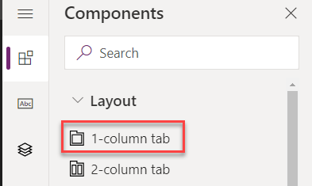

	- Select the new tab you added.

	- Go to the **Properties** pane, change the **Tab Label** to **Inspections** and the **Name** to **inspectionsTab**.  
‎

	

4. Steps to add Sub-Grid to the Permit form.

	- Select the **Inspections** tab. Make sure that you have selected the whole Tab and not just a section.

	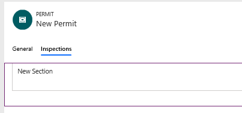

	- Click **Add Component**.

	- Scroll down and select **Subgrid,** this will open a pop-up to select Entity.

	- Check the **Show** **Related Records** checkbox, select **Inspections** for **Entity**, select **Active** **Inspections** for **Default View** and click **Done**.

	

5. Edit Sub-Grid properties.

	- Go to the sub-grid properties pane and change the Label to **Inspections**.

	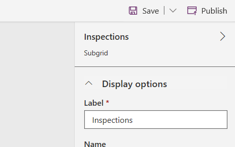

6. Steps to hide the section label

	- Click to select the section.

	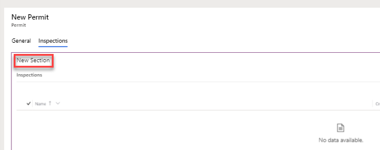

	- Go to the **Properties** pane and check the **Hide Label** checkbox.

	

7. Click **Save** and wait for the save to complete.

8. Click **Publish** and wait for the publishing to complete.

9. Click on the **&lt;- Back** button. You should now be back to the Permit entity Forms tab.

10. Steps to edit the Active Permits view.

	- Select the **Views** tab and click to open the **Active Permits** view.

	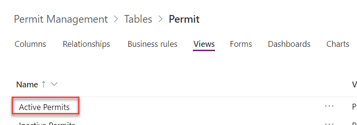

	- Drag the **Build Site** field and drop it between the **Name** and **Created On** fields.

	

	- Click on the **Permit Type** field. The Permit Type field will be added to the view.

	- Click on the **Contact** field. The **Contact** field will be added to the view.

	- Go to the view designer and click on the chevron icon of the **Created On** column.

	

	- Click **Remove**. **Created On** field will now be removed from the view.

	- Click **Save** and wait until the changes are saved.

	- Click **Publish** and wait for the publishing to complete.

11. Click on the **&lt;-Back** button.

## Task #2: Edit Build Site Form and View

1. Open the Permit Management solution.

	- Sign in to [Power Apps maker portal](https://make.powerapps.com/)

	- While in your dev environment, select **Solutions**, and click to open the **Permit Management** solution.

2. Edit the Build Site entity form.

	- Click to open the **Build Site** entity.

	- Select the **Forms** tab and click to open the **Main** form.

	- Add **City**, **State/Province**, **Zip/Postal Code**, and **Country Region** fields to the form between **Street Address** and **Owner**.

	

3. Click **Save** and wait until the changes are saved.

4. Click **Publish** and wait for the publishing to complete.

5. Click on the **&lt;-Back** button.

6. Edit the Active Build Sites view.

	- Select the **Views** tab and click to open the **Active Build Sites** view.

	- Add **City** and **Zip/Postal Code** to the view.

	- Remove **Created On** from the view by selecting **Remove** from the options in field Chevron.

	

7. Click **Save** and wait until the changes are saved.

8. Click **Publish** and wait for the publishing to complete.

9. Click on the **&lt;-Back** button.

 

## Task #3: Edit Inspection Form and View

1. Open the Permit Management solution.

	- Sign in to [Power Apps maker portal](https://make.powerapps.com/)

	- While in your dev environment, select **Solutions** and click to open the **Permit Management** solution.

2. Edit the Inspection entity form.

	- Click to open the **Inspection** entity.

	- Select the **Forms** tab and click to open the **Main** form.

	- Add **Inspection type**, **Permit**, **Scheduled Date**, and **Comments** fields to the form. **Inspection type**, **Permit**, **Scheduled Date** should be added between **Name** and **Owner**, while **Comments** will be added after the **Owner** field.

	- Drag the **Status Reason** field **Comments** and drop it in the right side of the form header.

	

	- The form should now look like the image below. 

	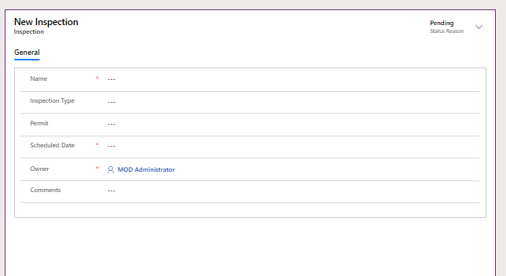

3. Click **Save** and wait until the changes are saved.

4. Click **Publish** and wait for the publishing to complete.

5. Click on the **&lt;-Back** button.

6. Edit the Active Inspections view.

	- Select the **Views** tab and click to open the **Active Inspections Sites** view.

	- Add **Inspection Type,** **Scheduled Date** and **Sequence** to the view.

	- Remove **Created On** from the view by selecting the chevron on the field and select **Remove**.

	

7. Click **Save** and wait until the changes are saved.

8. Click **Publish** and wait for the publishing to complete.

9. Click on the **&lt;-Back** button.

10. Create new Inspector View for the Inspection entity.

	- Make sure you still have the **Views** tab selected.

	- Click **+ Add View**. This will open a new window to create View.

	

	- Enter **Inspector View** for **Name** and click **Create**.

	- Add **Inspection Type**, **Permit**, **Scheduled Date**, and **Sequence** fields to the view.

	

11. Sort the Inspector View by the sequence.

	- Go to the view properties pane and click **Sort By**.

	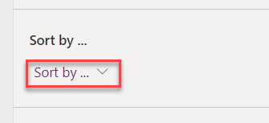

	- Select **Sequence**.

12. Filter the Inspector View.

	- Go to the view properties pane and click **Edit Filter**. This will open a new pop-up on the right side of the window.

	

	- Click **Add** and select **Add Row**.

	

	- Set the filter property by Selecting **Status Reason** in first dropdown and **Pending** in the third dropdown**.** Now, click **Add** and select **Add Row** again.

	

	- To set the filter property select **Owner** field in the first dropdown and Equals current user in second dropdown and click **OK**.

	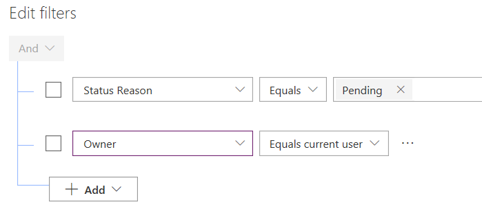

13. Click **Save** and wait until the changes are saved.

14. Click **Publish** and wait for the publishing to complete.

15. Once the changes are published, close the window and click **Done** on the previous window for the Power Apps.

 

 

## Task #4: Edit Permit Type Form

1. Open the Permit Management solution.

	- Sign in to [Power Apps maker portal](Mod%2002%20Model%20Driven%20App.docx)

	- Select your **Dev environment.**

	- Select **Solutions**.

	- Click to open the **Permit Management** solution.

2. Edit the Permit Type entity form.

	- Click to open the **Permit Type** entity.

	- Select the **Forms** tab and click to open the **Main** form.

	- Add **Require Inspections** and **Require Size** fields to the form between **Name** and **Owner**.

	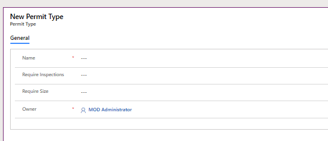

	- Click **Save** and wait until the changes are saved.

3. Click **Publish** and wait for the publishing to complete.

	- Click on the **&lt;-Back** button.

4. Edit the **Permit Type** entity **Active Permit Type** View.

	- Select the **Views** tab and click to open the **Active Permit Type** view.

	- Add **Require Inspections** and **Require Size** to the view.

	- Remove **Created On** from the view but selecting the chevron on the field and select **Remove**.

	

	- Click **Save** and wait until the changes are saved.

	- Click **Publish** and wait for the publishing to complete.

	- Click on the **&lt;-Back** button.

  
‎ 

# Exercise #2: Create Model-Driven Application

**Objective:** In this exercise, you will create the model-driven app, customize the sitemap, and test the app.

**Note:** You will see several fields not addressed as you build out your application, particularly on the sitemap steps. We have taken some short cuts in the interest of time for doing the labs. In a real project you would give these items logical names.

## Task #1: Create Application

1. Open the Permit Management solution.

	- Sign in to [Power Apps maker portal](https://make.powerapps.com/)

	- While in your dev environment, click to open the **Permit Management** solution.

2. Create the Model-Driven Application

	- Click **New** and select **App | Model-Driven App**. This will open a new Window.

	

	- Enter **Permit Management** for **Name** and click **Done**.

3. Edit Sitemap

	- Click **Edit Site map.**

	

4. Edit the default titles

	- Select **New Area**.

	- Go to the properties pane and enter **Building Dept**. for **Title**.

	- Select **New Group**.

	- Go to the **Properties** pane and enter **Permits** for **Title**.

 

	

5. Add the Permit entity to the sitemap

	- Select **New Subarea**.

	- Go to the **Properties** pane and select **Entity** from the dropdown for **Type**.

	- Search for **Permit** entity from the dropdown for **Entity**.

	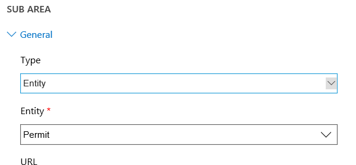

6. Add the Inspection entity to the sitemap

	- Select **Permits** group and click **Add**.

	

	- Select **Subarea**.

	- Go to the **Properties** pane.

	- Select **Entity** from the dropdown for **Type** and search for **Inspection** entity from the dropdown for **Entity**.

7. Add the Permit Type entity to the sitemap

	- Select **Permits** group and click **Add**.

	- Select **Subarea**.

	- Go to the **Properties** pane.

	- Select **Entity** from the dropdown for **Type** and search for **Permit Type** entity from the dropdown for **Entity**.

8. Add new Group to the sitemap

	- Select the **Building Dept.** area and click **Add.**

	

	- Click **Add** and select **Group**.

	- Select **Group**.

	- Go to the **Properties** pane and enter **Contacts** for Title.

9. Add the Contact entity to the Contacts group.

	- Select the **Contacts** group.

	- Click **Add** and select **Subarea.**

	- Go to the **Properties** pane.

	- Select **Entity** from the dropdown for **Type** and search for **Contact** entity in the dropdown for **Entity**.

10. Add the Build Site entity to the Contacts group.

	- Select the **Contacts** group.

	- Click **Add** and select **Subarea.**

	- Go to the **Properties** pane.

	- Select **Entity** from the dropdown for **Type** and search for **Build Site** entity in the dropdown for **Entity**.

11. The sitemap should now look like the image below.

	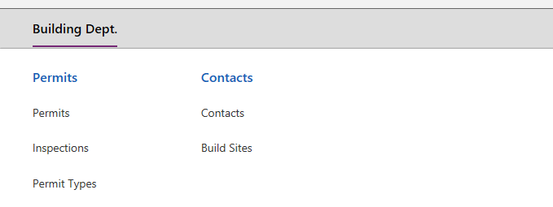

12. Click **Save**, this will show the loading screen while the changes are getting saved.

13. Click **Publish** to publish the sitemap and wait for the publishing to complete.

14. Click **Save and Close** to close the sitemap editor.

15. You will see the assets for the entities that were added to the sitemap are now all in the application.

  
	‎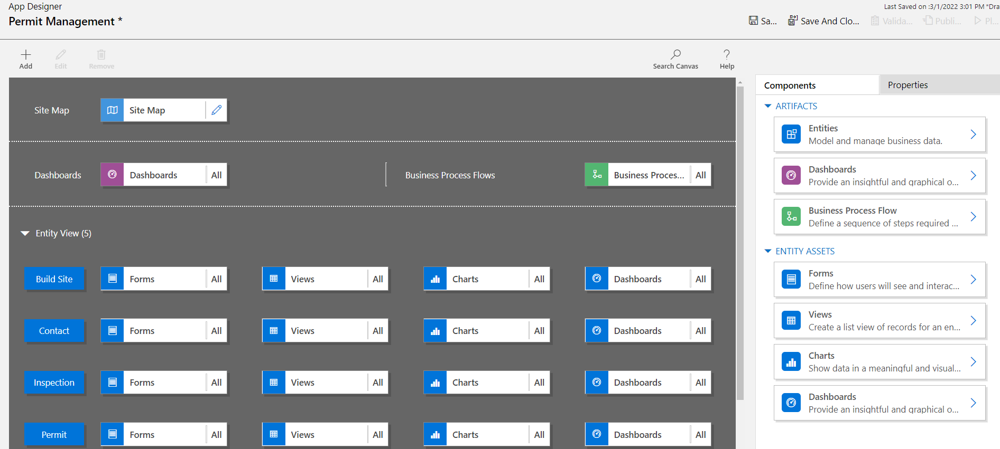

16. Click **Save** to save the application.

17. Click **Validate** to validate the changes done in the application. This will show some warnings. Feel free to review them, but we can ignore them, since we have not referenced a specific View and Form for the entities and this will display all the Views and Forms.

18. Click **Publish** to publish the application and wait for the publishing to complete.

19. Click **Save and Close to** close the app designer.

20. Click **Done**.

21. Click **Publish all Customizations.**

22. Select **Apps** and your application should now be listed in the Recent Apps.

	

 

## Task #2: Test Application

1. Start the application

	- Select **Apps** and click to open the **Permit Management** app in a new window.

2. Create new Contact record

	- Select **Contacts**  
‎	  
‎

	- Click **New** from the top menu.

	- Provide **First Name** as **John** and **Last Name** as **Doe**.

	- Click **Save and Close**.

	

	- You should now see the created contact on the **Active Contacts** view.

	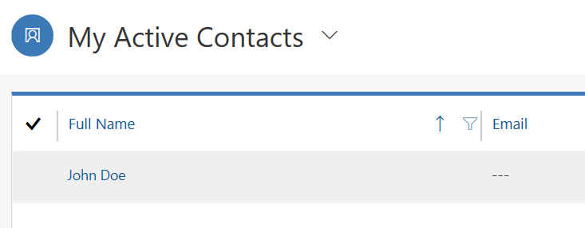

3. Create new Build Site record

	- Select **Build Sites** from the sitemap.

	- Click **New**.

	- Provide **Street Address**, **City**, **State/Province**, **Zip/Postal Code**, and **Country/Region** as:  
‎Street Address: One Microsoft Way

City: Redmond  
‎State/Province: WA

ZIP/Postal Code: 98052

Country/Region: USA

- Click **Save and Close** and this will show the newly created record on the Active Build Sites View.

	

4. Create new Permit Type record

	- Select **Permit Types** from the sitemap.

	- Click **New**.

	- Provide **Name** as **New Construction** and click **Save and Close**. This will create the record and you should be able to see it on the Active Permit Type View.

	

5. Create new Permit record

	- Select **Permits** from the sitemap.

	- Click **New**.

	- Provide **Name** as **Test Permit**, select the **Permit Type**, **Build Site**, and the **Contact** records you created in the previous steps.

	- Select a future date for the **Start Date** and click **Save**.

	

6. Create new Inspection record

	- Go to the **Inspections** tab. 

	- Click **+ New Inspections**.

	

	- Provide **Name** as **Framing Inspections**, select **Initial Inspection** from the dropdown for **Inspection Type**, and select future date for **Scheduled Date**.

	- Click **Save and Close.**

	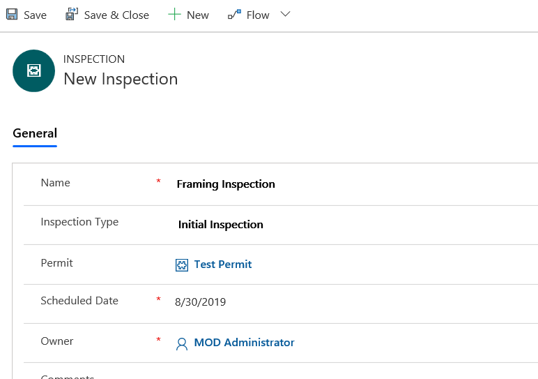

	- The **Inspection** record should now show on the **Permit** sub-grid.

	

7. You may add more test records.

 
