---
lab:
    title: 'Lab 11: Publishing Events Externally'
---

## Lab 08 – Publishing Events Externally

# Scenario

A regional building department issues and tracks permits for new buildings and updates for remodeling of existing buildings. Throughout this course you will build applications and automation to enable the regional building department to manage the permitting process. This will be an end-to-end solution which will help you understand the overall process flow.

In this lab you will use the event publishing capability of Microsoft Dataverse. When a permit results in changing the size of the build site, an external taxing authority needs to be notified so they can evaluate if additional taxing is required. You will configure Microsoft Dataverse to publish permits with size changes using the Webhook. To simulate the taxing authority receiving the information you will create a simple Azure function to receive the post. 

# High-level lab steps

As part of configuring the event publishing, you will complete the following:

- Create an Azure Function to receive the Webhook post

- Configure Microsoft Dataverse to publish events using a Webhook

- Test publishing of events

## Things to consider before you begin

- Do we know what events will trigger our Webhook?

- Could what we are doing with the Webhook, be done using Power Automate?

- Remember to continue working in your DEVELOPMENT environment. We’ll move everything to production soon.

  
‎ 

# Exercise #1: Create an Azure Function

**Objective:** In this exercise, you will create an Azure Function that will be the endpoint to accept and log incoming web requests.

 

## Task #1: Create Azure Function App

1. Create new function application

	- Sign in to [Azure portal](https://portal.azure.com) and login.

	- Select **Show portal menu** and then select **+ Create a resource**.

    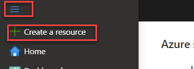

	- Search for Function App and select it.

    

	- Select **Create**.

    

	- Enter your initials plus today’s date for **App Name**, select your **Subscription**, select **Create New** for **Resource Group**, select **.NET** for Runtime Stack, **6** for Version, select location in the same region as **Microsoft Dataverse**, and then select **Review + Create**.

    

	- Select **Create** and wait for the deployment to complete.

## Task #2: Create an Azure Function

1. Create a new function

	- Select **Go to resource**.

    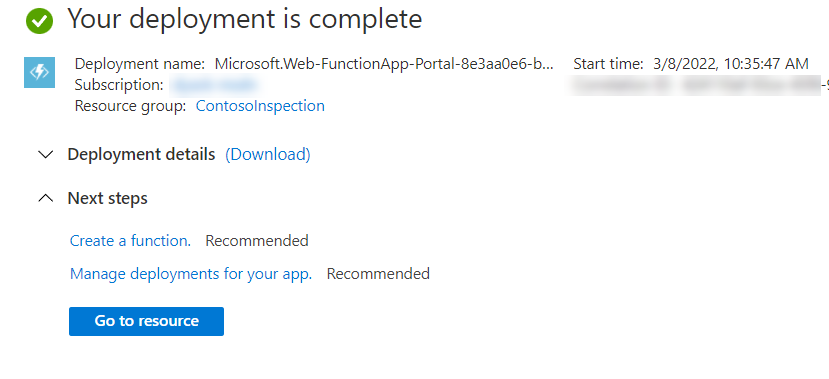

	- Select **Functions** and then select **+ Create**.

    

	- Select **HTTP trigger** for template and then select **Create**.

    

2. Test the function

	- Select **Code + Test**.

    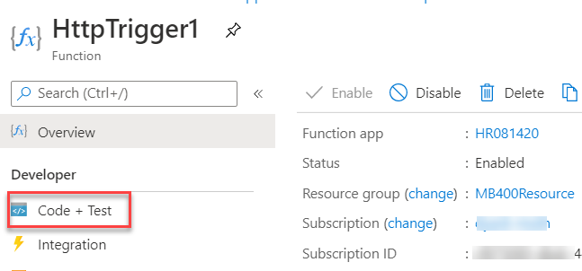

	- Select **Test**/**Run**.

    

	- Select **Run**.

	- You should see **Hello, Azure** in the output.

    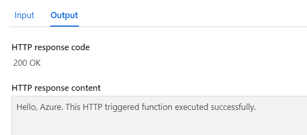

	- Close the test pane.

3. Edit the function

	- Replace the Run method with the method below.

            public static async void Run(HttpRequest req, ILogger log)
            {
                log.LogInformation("C# HTTP trigger function processed a request.");

                string requestBody = await new StreamReader(req.Body).ReadToEndAsync();
                dynamic data = JsonConvert.DeserializeObject(requestBody);
                string indentedJson = JsonConvert.SerializeObject(data, Formatting.Indented);
                log.LogInformation(indentedJson);
            }

	- Save your changes.

    

4. Remove HTTP output

	- Select **Integration**.

    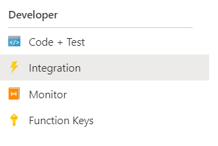

	- Select the **HTTP Output**.

    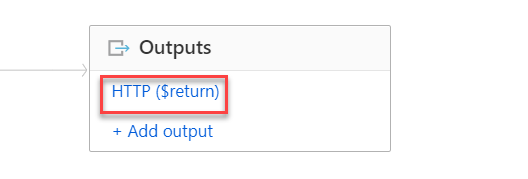

	- Select **Delete**.

    

	- Select **OK**.

5. Get the function URL

	- Select **Overview** and then select **Get Function URL**.

    

	- Select **Copy** and then select OK to close the popup.

    

	- Save the **URL**, you will need it in the next exercise.

# Exercise #2: Configure Webhook

## Task #1: Configure publishing to a Webhook

1. Download the SDK Toolkit. If you already have the Plugin Registration tool from the previous lab you can proceed to step three of this task.

	- Navigate to [https://xrm.tools/SDK](https://xrm.tools/SDK) 

	- Select **Download SDK Zip File**.

    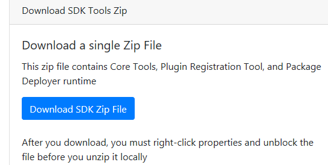

	- Save the zip file on your machine.

	- Right click on the downloaded **sdk.zip** file and select **Properties**.

	- Check the **Unblock** checkbox and then select **Apply**.

    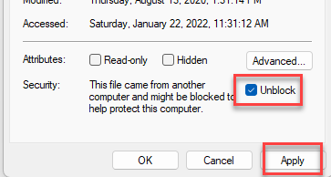

	- Select **OK**.

	- Right click on the **sdk.zip** file again and select **Extract All**.

	- Complete extracting.

2. Start the Plugin Registration Tool

	- Open the **sdk** folder you extracted and open the **PluginRegistration** folder.

    

	- Locate and double click PluginRegistration.exe.

    

3. Create new connection

	- Select **Create New Connection**.

    

	- Select **Office 365** and check the **Display List of available organization** and **Show Advanced** checkboxes. Select **Online Region** where your organization is located. If you are unsure what region to select, select **Don’t Know**.

	- Provide your **Microsoft Dataverse** credentials and **Login**.
   
    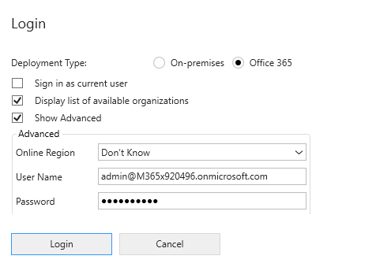

	- Select the **Dev** environment and then select **Login**.

    

4. Register new Webhook

	- Select **Register** and then select **Register New Webhook**.

    

	- Enter **NewSize** for **Name**.

	- Go to the notepad where you saved the function URL and copy everything before the **‘?’**.

    

	- Go back to the **Plugin Registration** tool and paste the **URL** you copied in the **Endpoint URL** field.

    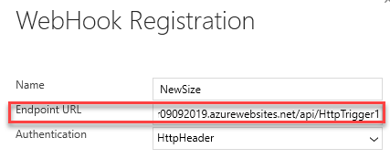

	- Select **WebhookKey** for **Authentication**.

	- Go back to the notepad and copy the key.

    

	- Go back to the **Plugin Registration** tool, paste the key you copied in the **Value** field and select **Save**.

    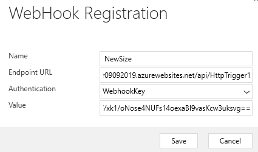

5. Register new step

	- Select the **Webhook** you registered, select **Register** and then select **Register New Step**.

    

	- Select **Update** Message, **contoso_permit** for Primary Entity, and select **Filtering Attributes.**

    

	- Select only **New Size** and then select **OK**.

    

	- Select **Asynchronous** for Execution Mode and then select **Register New Step**.

    

## Task #2: Test the Webhook

1. Start the Permit Management application

	- Sign in to [Power Apps maker portal](https://make.powerapps.com/) and make sure you have the **Dev** environment selected.

	- Select Apps and launch the Permit Management application.

    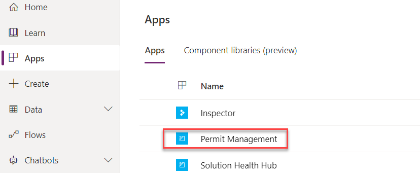

	- Select **Permits** and open one of the permit records. Create new if you don’t have a Permit record.

	- Change the **New Size** to **5000** and **Save**.

    

2. Check Azure Output

	- Go back to your **Azure Function**.

	- Select **Code + Test**.

	- Show **Logs**.

    

	- You should see logs like the image below. The Output is a serialized **RemoteExecutionContextobject** object

    

**Hint**: If the log is not showing in the console (sometimes this happens), select **Monitor** on the left and check execution log. Select entry, details will be on the right (this could be delayed up to a few minutes).

3. Confirm the function executes only when the New Size value changes

	- Go back to the **Permit Management** application.

	- Change the **Start Date** to tomorrow’s date and select **Save**.

    

Go back to the Azure Function and make sure the function did not execute.

## Task #3: Configure an entity image 

This step allows you to avoid unnecessarily querying Microsoft Dataverse and make a request only when you need information from the primary table. It can also be used to get the prior value of a column before an update operation.

1. Register New Image

	- Go back to the **Plugin Registration** tool.

	- Select the **NewSize** step you created, select **Register** and then select **Register New Image**.

    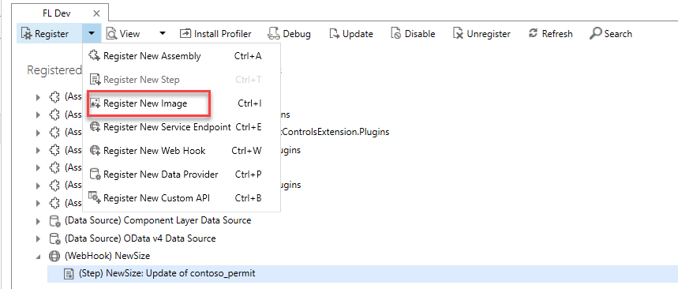

	- Check both **Pre** and **Post** images checkboxes.

	- Enter **Permit Image** for **Name**, **PermitImage** for **Entity Alias**, and then select the **Parameters** button.

    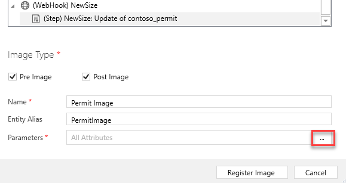

	- Select **Build Site**, **Contact**, **Name**, **New Size**, **Permit Type**, and **Start Date**, and then select **OK**.

    

	- Select **Register Image**.

    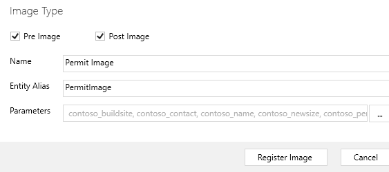

2. Clear Azure log

	- Go back to the **Azure Function.**

	- Select **Clear** logs.

    

3. Update Permit record

	- Go to the **Permit Management** application.

	- Select **Permits** and open one of the **Permit** records.

	- Change the New Size to **4000** and select **Save**

4. Check Azure logs

	- Go back to the **Azure Function**.

	- Maximize the log pane.

    

	- The logs should now show both **Pre** and **Post** entity images. In this case you should see the old value **5000** in **Pre** image and the new value **4000** in the **Post** image

    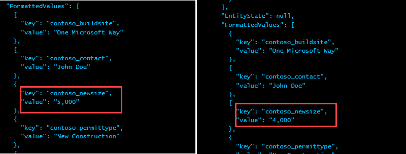

**Note:** Technically, we have the data in the target object already. However, if there are plugins modifying the data, PostImage will contain the copy as recorded in Microsoft Dataverse while Target contains the data was submitted on Save. In addition to that, preimage contains data before the save operation took place.
